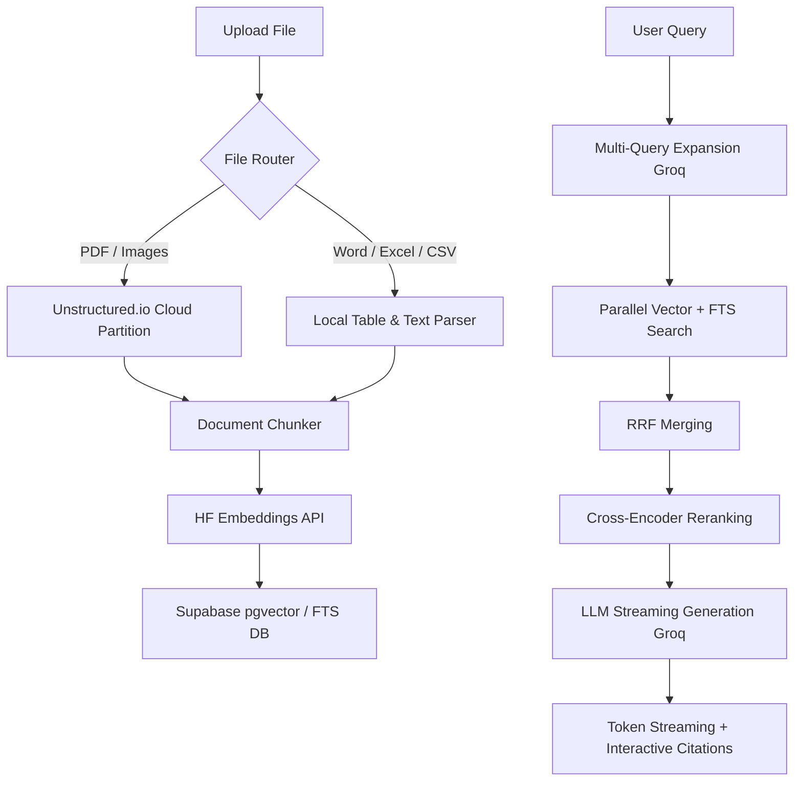

# AetherRAG: Enterprise Multimodal RAG Platform

AetherRAG is a production-grade, horizontally-scalable Multimodal Retrieval-Augmented Generation (RAG) platform. It processes complex layouts (PDFs, Docx, Excel, CSVs, Images) using layout-aware partition engines, performs high-fidelity retrieval using hybrid pgvector schemas, and streams responses token-by-token using LangGraph and Next.js.

---

## 🚀 Key Architectural Highlights

*   **Multimodal, Layout-Aware Document Parsing**: Bypasses basic text splitters by routing PDFs and images to **Unstructured.io Serverless APIs** to isolate titles, narrative paragraphs, tables, and images. It processes CSV, XLSX, and Word files locally to maximize processing speed.
*   **Intact Table Isolation Strategy**: Prevents tables from being sliced in half. Chunks containing structured tables are isolated and saved completely intact in the database alongside their HTML representations for pixel-perfect frontend grid rendering.
*   **Double Reciprocal Rank Fusion (RRF)**: Merges ranked retrieval outputs from vector similarities and full-text keyword searches across 4 separate query dimensions.
*   **Cross-Encoder Reranking**: Re-evaluates retrieval candidates against the user's original query using a cross-encoder model (**`BAAI/bge-reranker-base`**) via Hugging Face Serverless APIs.
*   **Stateful Multi-Turn Conversation Flows**: Driven by a compiled **LangGraph StateGraph** that persists conversation history in a PostgreSQL database (`PostgresSaver` checkpointer).
*   **Token-by-Token streaming UI**: Streams answers in real-time as Server-Sent Events (SSE) from FastAPI, rendering responses dynamically on the frontend.
*   **Secure Authentication**: Fully protected client dashboard utilizing **Clerk Auth (v5)** middleware.

---

## 🛠️ Technology Stack

| Component | Technology | Description |
| :--- | :--- | :--- |
| **Frontend** | Next.js 16 (App Router), TypeScript, Tailwind CSS | Dashboard UI, streaming hook, source citations drawer |
| **Backend API** | FastAPI, Uvicorn, SQLAlchemy | REST API, SSE streaming generator |
| **Orchestration** | LangGraph, LangChain | StateGraph execution, checkpointers, state persistence |
| **Async Worker** | Celery, Redis (Upstash) | Background ingestion queue, parsing & embedding |
| **Database** | PostgreSQL (Supabase), pgvector | Document store, vector store, thread checkpoints |
| **Models** | Groq (`llama-3.3-70b-versatile`, `llama-3.1-8b-instant`) | Inference engines for generation & query expansion |
| **Embeddings** | Hugging Face Inference API (`bge-small-en-v1.5`) | 384-dimensional sentence embeddings |

---

## 🔍 Ingestion & Retrieval Pipeline



---

## 💻 Local Setup Guide

Follow these steps to run the frontend, backend, and background worker concurrently on your machine.

### Prerequisites
*   Python 3.12+ (managed via `uv` recommended)
*   Node.js 18+ and `npm`
*   Docker (Optional, if running local PostgreSQL / Redis)

---

### 1. Backend Setup

1.  Navigate to the `backend` folder:
    ```bash
    cd backend
    ```
2.  Install dependencies using `uv` (creates a virtual environment automatically):
    ```bash
    uv sync
    ```
3.  Create a `.env` file in the `backend/` folder and populate it:
    ```env
    ENV=development
    DATABASE_URL=postgresql://postgres.yourproject:<password>@aws-0-us-east-1.pooler.supabase.com:6543/postgres
    REDIS_URL=rediss://default:<token>@your-redis-instance.upstash.io:6379?ssl_cert_reqs=none
    
    GROQ_API_KEY=gsk_your_groq_key
    HUGGINGFACE_API_KEY=hf_your_hf_key
    UNSTRUCTURED_API_KEY=your_unstructured_key
    UNSTRUCTURED_API_URL=https://api.unstructuredapp.io/general/v0/general
    
    STORAGE_PROVIDER=local
    STORAGE_BUCKET_NAME=documents
    
    CLERK_SECRET_KEY=sk_test_your_clerk_secret
    ```
4.  Start the FastAPI server:
    ```bash
    uv run uvicorn app.main:app --reload --port 8000
    ```
5.  In a separate terminal, start the Celery async worker:
    *   **On Windows (solo pool required)**:
        ```bash
        uv run celery -A app.worker.celery_app worker --loglevel=info -P solo
        ```
    *   **On Linux / macOS**:
        ```bash
        uv run celery -A app.worker.celery_app worker --loglevel=info
        ```

---

### 2. Frontend Setup

1.  Navigate to the `frontend` folder:
    ```bash
    cd ../frontend
    ```
2.  Install npm packages:
    ```bash
    npm install
    ```
3.  Create a `.env.local` file in the `frontend/` folder:
    ```env
    NEXT_PUBLIC_API_URL=http://localhost:8000/api
    
    NEXT_PUBLIC_CLERK_PUBLISHABLE_KEY=pk_test_your_clerk_pub_key
    CLERK_SECRET_KEY=sk_test_your_clerk_secret
    
    NEXT_PUBLIC_CLERK_SIGN_IN_URL=/sign-in
    NEXT_PUBLIC_CLERK_SIGN_UP_URL=/sign-up
    ```
4.  Start the Next.js development server:
    ```bash
    npm run dev
    ```

---

### 3. Verification

*   Open **`http://localhost:3000`** in your browser.
*   Sign up/in via Clerk.
*   Create a chat thread, upload a PDF/CSV/Docx/TXT document, and watch the status update live to `Ready`.
*   Send a query and see the response stream token-by-token with clickable citation highlights!
