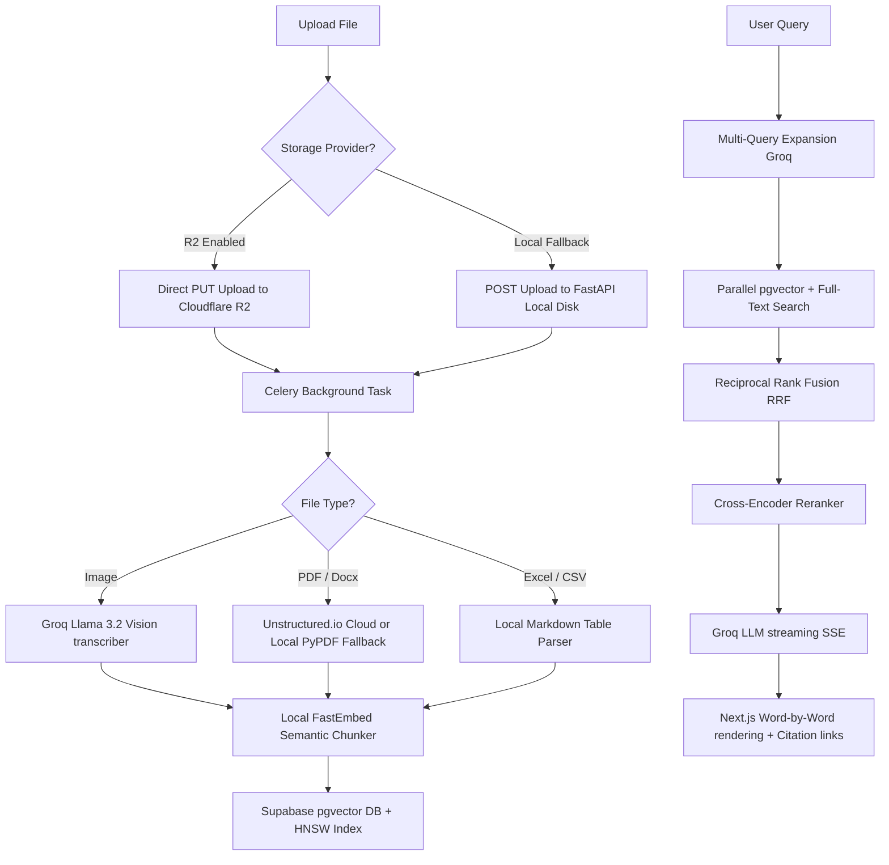

# AetherRAG: Production-Grade Multimodal RAG Platform

AetherRAG is a highly scalable, enterprise-grade Multimodal Retrieval-Augmented Generation (RAG) platform. It allows users to upload documents of various formats (PDFs, Word documents, Excel sheets, CSVs, and Images), parses them with advanced layout extraction engines, embeds them, indexes them in a pgvector database, and provides a token-by-token streaming chat interface with inline clickable citations.

---

## 🚀 Core Features & Capabilities

*   **Multimodal File Support**: Processes PDFs, DOCX, XLSX, CSV, TXT, and Images (PNG, JPG, JPEG, WEBP).
*   **Direct-to-Object Storage Ingestion (R2 Uploads)**: Uploads files directly from your browser to Cloudflare R2 using temporary pre-signed PUT URLs. This frees up the backend API, prevents server crashes, and supports parallel uploads.
*   **Local Storage Fallback**: If Cloudflare R2 is not configured, the application automatically falls back to saving files on your local hard disk for easy local testing.
*   **Fail-Safe Multi-Stage Parsers**:
    *   *Cloud Path*: Uses layout-aware **Unstructured.io API** to extract text structures, tables, and sections.
    *   *Multimodal Vision*: Automatically transcribes image data (charts, diagrams, tables) using the **Groq Llama 3.2 Vision Model**.
    *   *Local PDF Fallback*: If the cloud APIs are offline, it falls back to **PyPDF** to extract text fully offline.
*   **Local Semantic Chunking**: Segments document text dynamically based on sentence embedding differences using **FastEmbed** running locally on your CPU (zero external API calls).
*   **Two-Stage Hybrid Retrieval & Reranking**:
    1.  *Multi-Query Expansion*: Generates 3 alternative phrasings of the query using Groq.
    2.  *Hybrid Search*: Queries pgvector (semantic search) and PostgreSQL Full-Text Search (keyword search) in parallel.
    3.  *Rank Fusion*: Merges candidates using Reciprocal Rank Fusion (RRF).
    4.  *Attentional Reranking*: Sorts the top candidates using a Cross-Encoder reranker (`bge-reranker-base`).
*   **HNSW Vector Database Index**: Automatically deploys a Hierarchical Navigable Small World (HNSW) index over pgvector on startup, speeding up semantic search queries by 10x-100x.
*   **Stateful Multiturn Conversations**: Uses **LangGraph** to coordinate query, retrieval, and generation states with database checkpointers.
*   **SSE Token Streaming & R2 Citations**: Streams answers in real-time. Inline citation pills link directly back to secure, presigned download/view URLs of the source documents in Cloudflare R2.

---

## 🔍 Ingestion & Retrieval Pipeline



---

## 💻 Local Setup Guide

Follow these steps to run the frontend, backend, and background Celery worker concurrently on your machine.

### Prerequisites
*   Python 3.12+ (managed via `uv` recommended)
*   Node.js 18+ and `npm`
*   PostgreSQL database (local Docker or Supabase)

---

### Step 1: Configure Environment Variables

Create the configuration files in your editor (VS Code).

#### 1. Backend `.env` (`backend/.env`)
Create a file named `.env` in the `backend/` directory:
```env
ENV=development
DEBUG=true
PROJECT_NAME="Enterprise Multimodal RAG API"
PORT=8000
HOST=0.0.0.0

# Database
DATABASE_URL=postgresql://<username>:<password>@<host>:5432/<dbname>

# Task Queue (Redis Broker)
REDIS_URL=redis://localhost:6379/0

# Storage Config (Choose 'local' or 'r2')
STORAGE_PROVIDER=local
STORAGE_BUCKET_NAME=documents

# Cloudflare R2 Credentials (Optional, set STORAGE_PROVIDER=r2 if using)
CLOUDFLARE_ACCOUNT_ID=your_cloudflare_account_id
R2_ACCESS_KEY_ID=your_access_key
R2_SECRET_ACCESS_KEY=your_secret_key
R2_BUCKET_NAME=your_bucket_name

# AI API Keys
GROQ_API_KEY=your_groq_api_key
HUGGINGFACE_API_KEY=your_huggingface_api_key
UNSTRUCTURED_API_KEY=your_unstructured_api_key
UNSTRUCTURED_API_URL=https://api.unstructuredapp.io/general/v0/general

# Clerk Security
CLERK_SECRET_KEY=your_clerk_secret_key
```

#### 2. Frontend `.env.local` (`frontend/.env.local`)
Create a file named `.env.local` in the `frontend/` directory:
```env
NEXT_PUBLIC_API_URL=http://localhost:8000/api

# Clerk Authentication
NEXT_PUBLIC_CLERK_PUBLISHABLE_KEY=pk_test_your_publishable_key
CLERK_SECRET_KEY=sk_test_your_secret_key
NEXT_PUBLIC_CLERK_SIGN_IN_URL=/sign-in
NEXT_PUBLIC_CLERK_SIGN_UP_URL=/sign-up
```

---

### Step 2: Backend Installation

1.  Navigate to the `backend` directory:
    ```bash
    cd backend
    ```
2.  Install dependencies and synchronize your virtual environment:
    ```bash
    uv sync
    ```
3.  Start the FastAPI backend server:
    ```bash
    uv run uvicorn app.main:app --port 8000
    ```
4.  In a separate terminal window, start the Celery async worker:
    *   **On Windows (solo execution pool)**:
        ```bash
        uv run celery -A app.worker.celery_app worker --loglevel=info -P solo
        ```
    *   **On macOS / Linux**:
        ```bash
        uv run celery -A app.worker.celery_app worker --loglevel=info
        ```

---

### Step 3: Frontend Installation

1.  Navigate to the `frontend` directory:
    ```bash
    cd ../frontend
    ```
2.  Install packages:
    ```bash
    npm install
    ```
3.  Start the Next.js development server:
    ```bash
    npm run dev
    ```

---

### Step 4: Verification
*   Open your browser to **`http://localhost:3000`**.
*   Sign up/in via Clerk, create a chat thread, and upload files.
*   Once the upload completes, ask questions and observe real-time citation highlights!
